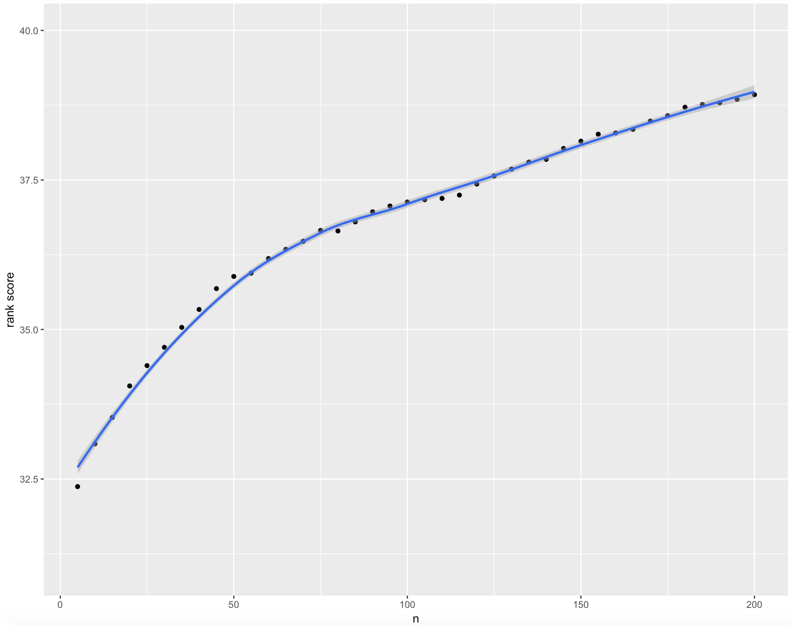
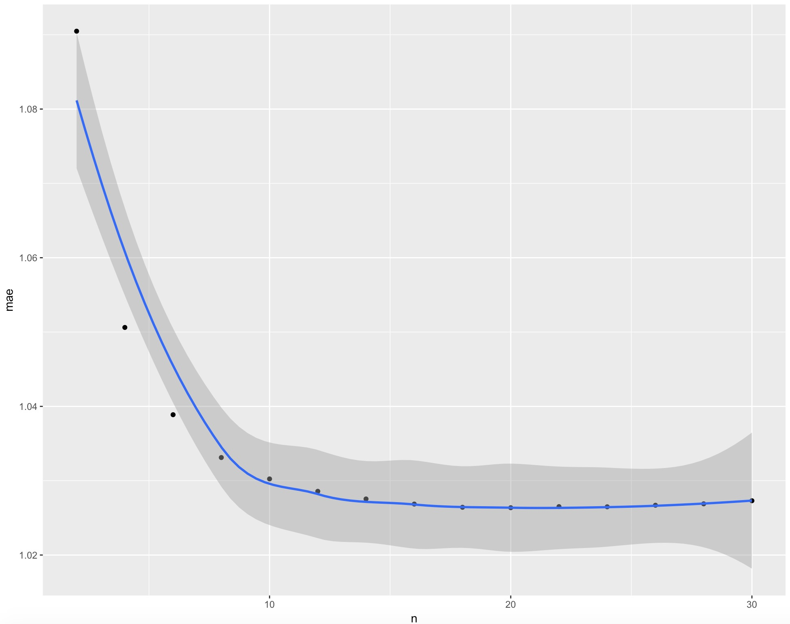
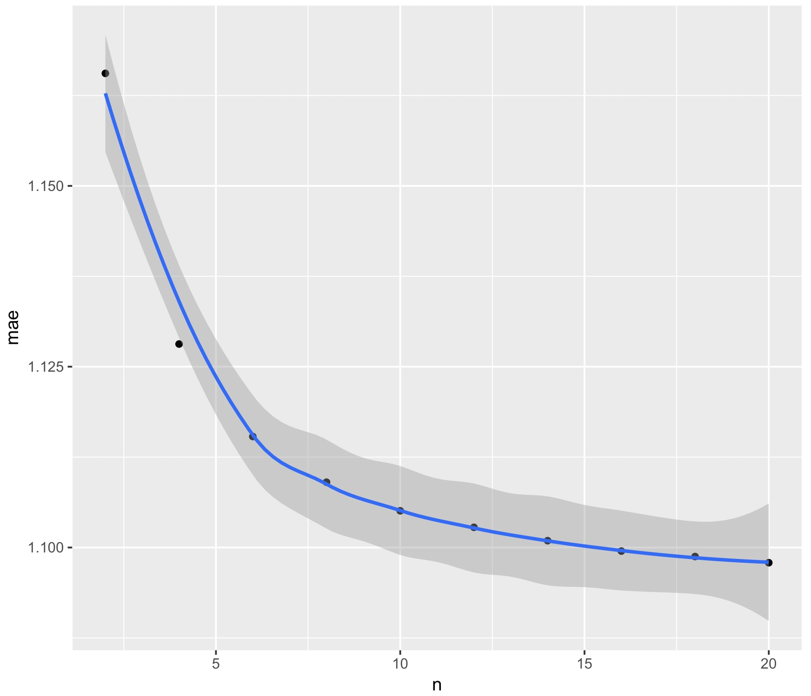
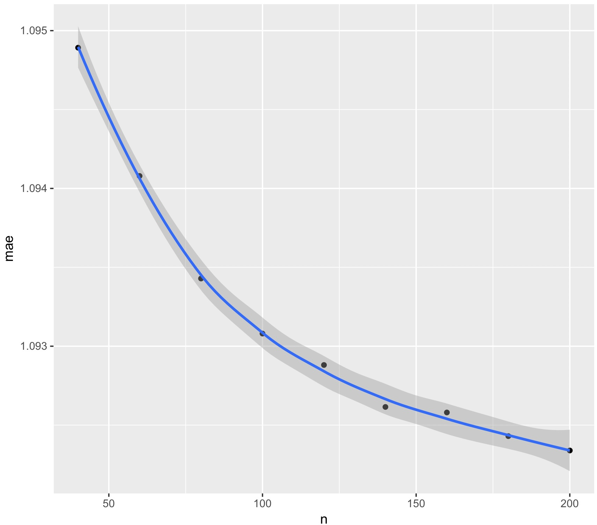
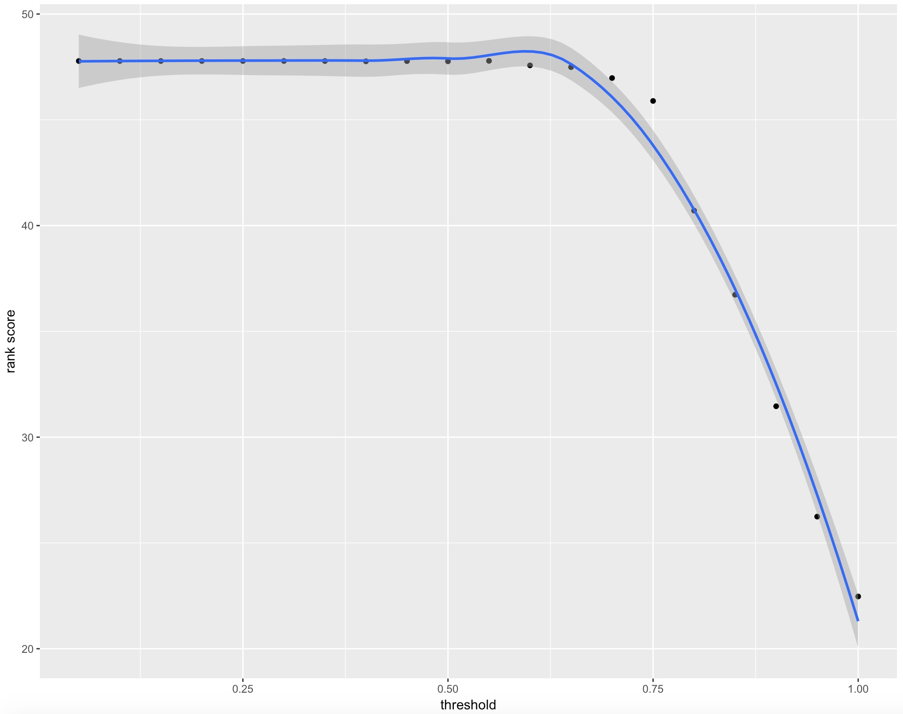
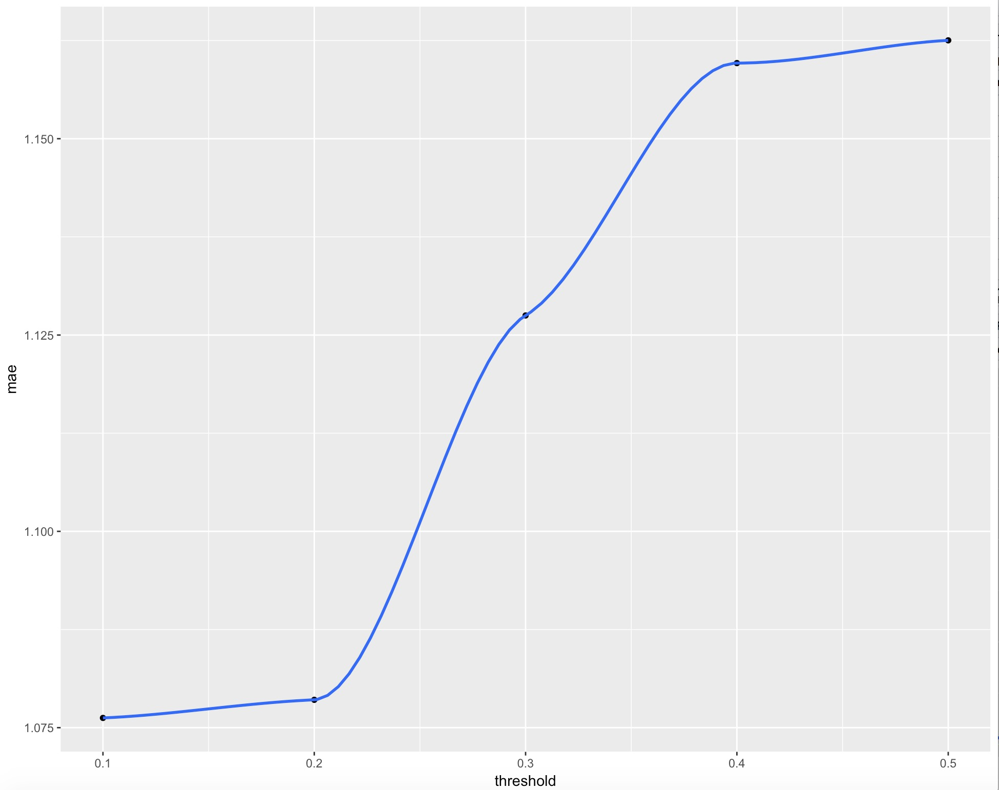

# Overview
In this project, we aim to predict user-item score through collaborative filtering. In the memoery based methods, we adopted 3 similarity metrics (vector similarity, mean square difference and simrank) to calculate weight, in step 2.And then, we used weight threshold and best-n-estimator, or a combination of both to select neighbours. As for evaluation, we implemented mae and ranked scoring. In order to find the suitable threshold and the best n, we tuned those parameters in step 3.  
\newline

In step 5 and 6, we implemented the model based method: cluster model. We first implemented the EM algorithm in the training process, and build a test function which involves cluster model prediction and evaluation (rank scoring). And then we tune parameters to choose the best parameter ó number of cluster.

load packages
```{r}
if(!require(reshape2)) install.packages("reshape2") 
if(!require(ggplot2)) install.packages("ggplot2") 
if(!require(jpeg)) install.packages("jpeg")
library(reshape2)
library(ggplot2)
library(jpeg)
```


# Step 1: Load Data
```{r}
movie_train_raw <- read.csv('../data/data_sample/eachmovie_sample/data_train.csv',header = T)
movie_test_raw <- read.csv('../data/data_sample/eachmovie_sample/data_test.csv',header = T)
MS_train_raw <- read.csv('../data/data_sample/MS_sample/data_train.csv',header = T)
MS_test_raw <- read.csv('../data/data_sample/MS_sample/data_test.csv',header = T)
```

## Reshape Data
```{r}
# ms data
source('../lib/preprocess.R')
## load processed data
load('../output/ms_train.RData')
load('../output/ms_test.RData')

# movie data
## train
dcast_train <- dcast(movie_train_raw, User~Movie)
rownames(dcast_train) <- dcast_train$User
movie_train <- dcast_train[,-1]
## test
dcast_test <- dcast(movie_test_raw, User~Movie)
rownames(dcast_test) <- dcast_test$User
movie_test <- dcast_test[,-1]
## save file
savefile = FALSE
if(savefile == TRUE) save(movie_train,movie_test, file = '../output/movie_wide.RData')
load('../output/movie_wide.RData')
```

# Step 2: Compute Similarity (weight)
## Vector Similarity
### Movie data
```{r}
# load vector similarity function
source('../lib/mat_weight.R')

# whether run vector similarity and whether save csv file
run.vec = FALSE
save.rd = FALSE
movie_vec_weight <- mat_weight(data = movie_train_raw, 
                              run.vec = run.vec,
                              run.msd = FALSE)

# save output in RData
if(save.rd == TRUE) save(movie_vec_weight, file = '../output/movie_vec_weight.RData')

# load output data
load('../output/movie_vec_weight.RData')
```

### MS data
```{r}
# whether run vector similarity and whether save csv file
run.vec = FALSE
save.rd = FALSE
ms_vec_weight <- mat_weight(data = ms_train, 
                           run.vec = run.vec,
                           run.msd = FALSE)

# save output in RData
if(save.rd == TRUE) save(ms_vec_weight, file = '../output/ms_vec_weight.RData')

# load output data
load('../output/ms_vec_weight.RData')
```

## Mean Sqaure Difference
### Movie data
```{r}
# whether run vector similarity and whether save csv file
run.msd = FALSE
save.rd = FALSE
movie_msd_dissimilar <- mat_weight(data = movie_train_raw, 
                                   run.vec = FALSE,
                                   run.msd = run.msd)
# convert dissimilarity to similarity weight
movie_msd_weight <- (max(movie_msd_dissimilar) - movie_msd_dissimilar ) /
  ( max(movie_msd_dissimilar) - min(movie_msd_dissimilar) )

# save output in RData
if(save.rd == TRUE) save(movie_msd_weight, file = '../output/movie_msd_weight.RData')

# load output data
load('../output/movie_msd_weight.RData')

```

### MS data
```{r}
run.msd = FALSE
save.rd = FALSE
ms_msd_dissimilar <- mat_weight(data = ms_train, 
                            run.vec = FALSE,
                            run.msd = run.msd)

# convert dissimilarity to similarity weight
ms_msd_weight <- (max(ms_msd_dissimilar) - ms_msd_dissimilar ) /
  ( max(ms_msd_dissimilar) - min(ms_msd_dissimilar) )

# save output in RData
if(save.rd == TRUE) save(ms_msd_weight, file = '../output/ms_msd_weight.RData')

# load output data
load('../output/ms_msd_weight.RData')
```

## Simrank (movie)
Note: simrank method is written in python
```{r}
# read in the simrank weight
load('../output/movie_simrank_weight.RData')
```

# Step 3: Tune parameters for different selecting neighbor methods
In this part, we use best n neighbors, threshold methods and a combination of both to select neighbors. However, before we go straight to evaluation, we need to how many neighbors to included for prediction. Thus, we need to tune parameters.  

For best-n-neighbor, n represents the number of neighbors we use for prediction. Starting with small n, initially, MAE would decrease or Ranked Score would increase as n increases, since more neighbors of an user is included. As n increases, more and more information is obtained and used for prediction. Eventually, MAE and Ranked Score with converage.

For threshold method, we only included neighbors has similarity scores that are higher than a certain threshold and the threshold ranges from 0 to 1.  Thus, choosing a good threshold is important. If the threshold is too high, only few or no neighbors will be included. While if the threshold is too low, then many neighbors are included, which could be less inefficient during prediction. Compare to best-n-neighbor, when the threshold is close to 1, less neigbors are selected, thus the MAE would be high, whereas Ranked Score would be low. As threshold decreases, more neighbors are included. So MAE would decrease, while Ranked Score would increase and they would converge.

The performances of different parameters values are shown below.

load functions
```{r}
source('../lib/tuning.R')
```
load our results instead of rerun the codes
```{r}
run.tune = FALSE
load('../data/movie_vec_bestn_result.Rdata')
```

## Best-n-estimators and evaluate with rankscore (MS data with msd weight)
```{r,out.width = '80%'}
# ms msd
n <- seq(5,200,by=5)
if(run.tune) ms_msd_bestn <- tuning_ms(ms_train,ms_test,ms_msd_weight,'bestn')[1:length(n)]

```

## Best-n-estimators and evaluate with mae (Movie data with vector weight)
```{r ,out.width = '80%'}
# movie vec
if(run.tune) movie_vec_bestn <- tuning_movie(movie_train,movie_test,movie_vec_weight, 'bestn')[1:length(n)]
n <- seq(2,30,by=2)

```


## Best-n-estimators and evaluate with mae (Movie data with simrank weight)
```{r,out.width = '80%'}
# movie simrank best n
if(run.tune) {
  movie_simrank_bestn <- tuning_ms(ms_train,ms_test,movie_simrank_weight,'bestn')[1:length(n)]}


```

## Threshold and evaluate with rankscore (MS data with msd weight)
```{r,out.width = '80%'}
threshold <- seq(0.05,1,by=0.05)
if(run.tune) ms_msd_threshold <- tuning_ms(ms_train,ms_test,ms_msd_weight, 'threshold')[1:length(threshold)]

```

## Threshold and evaluate with mae (Movie data with vector weight)
```{r,out.width = '80%'}
if(run.tune) movie_vec_threshold <- tuning_movie(movie_train,movie_test,movie_vec_weight,
                                             'threshold')[1:length(threshold)]

```

## Combine
```{r}
threshold <- seq(0.05,1,by=0.05)
n <- seq(5,200,by=5)
par = list(threshold,bestn = n)
if(run.tune){
  ms_msd_threshold <- tuning_ms(ms_train,ms_test,ms_msd_weight, 'combined')[1:length(threshold)]
}

```

## final parameter
```{r}
best.par <- list(n = 60, threshold = 0.6)
```


# Step 4: Prediction & Evaluation

## load functions
```{r}
source('../lib/predict_score.R')
```

### MS test Prediction
```{r}
# chose which selecting neighbor method to use
run.bestn = TRUE
run.threshold = TRUE
run.pred = FALSE
if(run.pred){
  # using vector similarity weight
  pred.ms.vec <- predict.score.ms(ms_train,
                                  ms_test,
                                  ms_vec_weight,
                                  run.threshold = run.threshold,
                                  run.bestn = run.bestn)
  # using msd weight
  pred.ms.msd <- predict.score.ms(ms_train,
                                  ms_test,
                                  ms_msd_weight,
                                  run.threshold = run.threshold,
                                  run.bestn = run.bestn)
}
```

## Movie Data
```{r}
# chose which selecting neighbor method to use
run.bestn = TRUE
run.threshold = TRUE
run.pred = FALSE
if(run.pred){
  # using vector similarity weight
  pred.movie.vec <- predict.score.movie(movie_train,
                                        movie_test,
                                        movie_vec_weight,
                                        par = best.par,
                                        run.threshold = run.threshold,
                                        run.bestn = run.bestn)
  # using msd similarity weight
  pred.movie.msd <- predict.score.movie(movie_train,
                                        movie_test,
                                        movie_msd_weight,
                                        par = best.par,
                                        run.threshold = run.threshold,
                                        run.bestn = run.bestn)
  # using simrank weight
  pred.movie.simrank <- predict.score.movie(movie_train,
                                            movie_test,
                                            movie_simrank_weight,
                                            par = best.par,
                                            run.threshold = run.threshold,
                                            run.bestn = run.bestn)
}
```

## MAE
load functions
```{r}
source('../lib/mae.R')
```

### MAE for Movie Data
```{r}
run.MAE = FALSE
if(run.MAE){
  mae.movie.vec <- MAE(pred.movie.vec, movie_test)
  mae.movie.vec
}
```

## Rank Score
load functions
```{r}
source('../lib/ranked_scoring.R')
```
### Rank score MS Data
```{r}
run.rankscore = FALSE
if(run.rankscore){
  rankscore.ms.vec <- rank_matrix(pred.ms.vec, ms_test)
  rankscore.ms.vec
}
```


## Result
Using msd as weight yields the best result, with ranked score of 47.5.
Similarly, for movie data, msd also gives the best result, with the smallest MAE 0.96.

# Step 5: Model-based Algorithm
## Clustering (MS Dataset)
### Cross Validating the cluster model to find best cluster number C
```{r}
source("../lib/cluster_model.R")

preprocess_for_cluster(preprocess.train = F, preprocess.test = F, reshape.train = F, reshape.test = F)

load("../output/ms_train_wide.RData")
load("../output/ms_test_wide.RData")

list_of_items <- names(train[,-1])

cross.validate.model.clustering <- FALSE
if(cross.validate.model.clustering){
  r <- c()
  parameters <- c(4,5,6,7,8)
  for(par in parameters){
    trained.cluster.model <- train.cluster.model(train, C = par)
    g <- trained.cluster.model$gamma_array
    m <- trained.cluster.model$mu
    p <- trained.cluster.model$pi_mat
    testing <- test.cluster.model(test, gamma_array = g, mu = m, pi_mat = p, list_of_items = list_of_items)
    r <- c(r, testing$r)
    print(paste("For number of clusters equal to:", par, "Rank score:", testing$r))
  }
  
  t <- matrix(NA, ncol = length(parameters), nrow = 2)
  t[1,] <- parameters
  t[2,] <- r
  rownames(t) <- c("C", "Rank Score")
  save(t, file = "../output/cv_cluster_rank_score.Rdata")
}

```

# Step 6: Evaluation for Cluster model
## Rank Score
load output rank score
```{r}
load("../output/cv_cluster_rank_score.Rdata")
```
print output
```{r}
print(t)
best.C <- as.numeric(t[1, which.max(t[2,])])
best.rank.score <- as.numeric(max(t[2,]))
print(paste("The best cluster number is:", best.C, ". Rank score is:", best.rank.score))
```

Based on the validation result, we chose our the best parameter (number of cluster) to be 4. And the resulting evaluation from the testing set has rank score of 41.32. 
